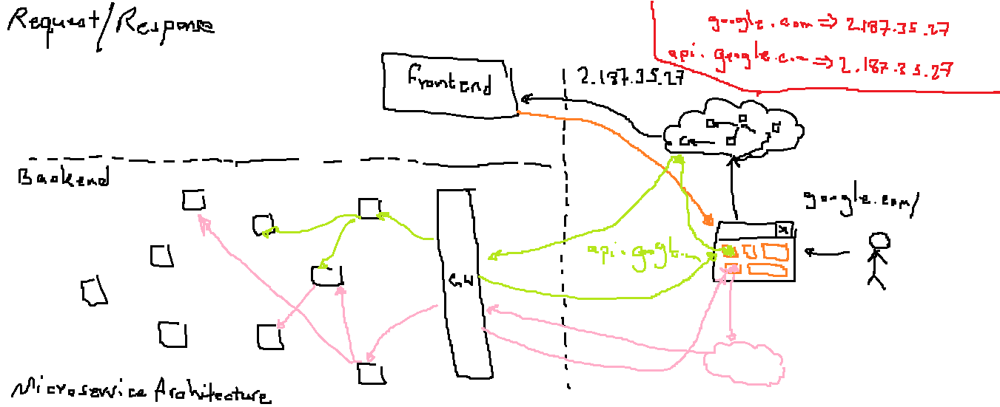
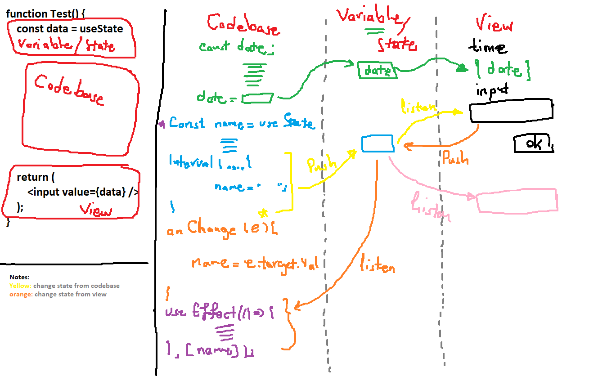
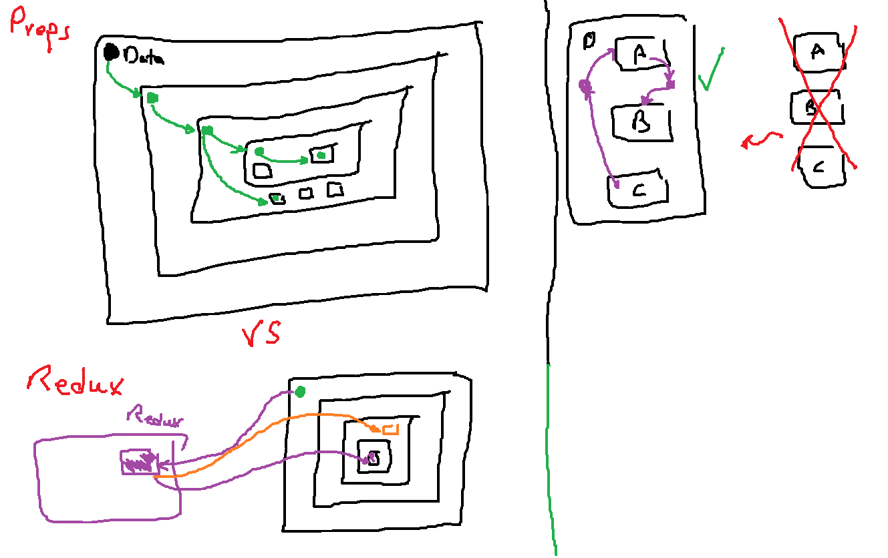
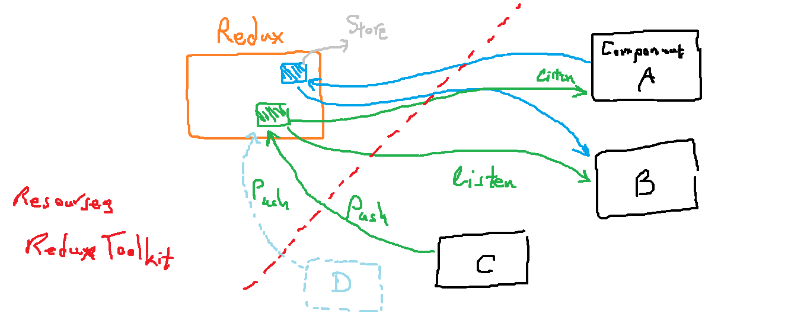
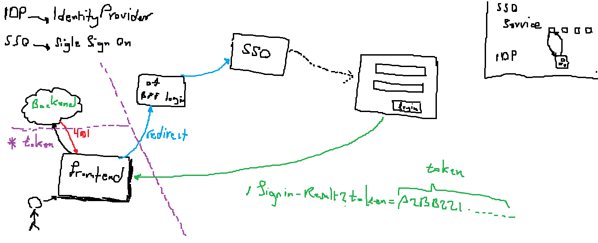

# React Concepts

## Request / Response


## Data Binding


## Components Communication
### Using props


### Using Redux


## Identity Provider (IDP)


## Functions
### Normal Function
```
function add(a, b) {
	return a+b;
}
```

You are not allowed a normal function as a tag inside a JSX:
```
<div>
	<add a=2 b=3 />
</div>
```

The above code will throw an exception!

### Function Component

```
function Add(a, b) {
	return (
		<div>{ a+b }</div>
	)
}
```

Using a function component:
```
<div>
	<Add a=2 b=3 /> √
</div>
```

### Custom Hook
If you want to use any kind of hooks inside a function, you have to define a custom hook! hooks always starts with use.

```
function useAdd(a, b) {
	const [sum, setSum] = useState(0);
	setSum(a + b + 10);	

	return [sum];
}
```

#### Background Information

**Some useful keywords:**
- react how to create custom hook
- react how to create custom hook hello world
- react handle parameters in function component
- react function component parameters

## Javascript Destructuring
### JSON

```
const obj = {
    name: 'Somayeh',
    country: 'Netherlands',
    field: 'software'
    score: 20
}
```

**Accessing name and country field:**

Normal method:
```
obj.name
obj.country
```

Destructuring
```
const {name, country} = obj; // destructure

console.log(name);   // obj.name
console.log(family); // obj.family
```

### ARRAY

```
const arr = ['somayeh', 'Netherlands', 'software', 20];
```

Normal method:
```
arr[2]
arr[3]
```

Destructuring
```
const [,ctry,fld] = arr; // destructure
console.log(ctry) // arr[1]: Netherlands
console.log(fld) // arr[2]: software
```